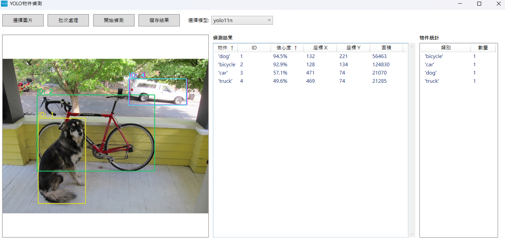

# YOLOv11-WPF-App



此專案是基於[YOLOv11-WPF-Windows-Application](https://github.com/e96031413/YOLOv11-WPF-Windows-Application.git)的修改版本
主要目的是希望進行瑕疵偵測, 因此新增了物件統計分析功能, 且為方便使用此版本支持拖曳圖片上傳功能

## 功能特點

- 📷 支援多種圖片格式（JPG、PNG、BMP）
- 🔄 支援多種YOLO模型選擇
- 📊 即時顯示偵測結果(包含物件, 座標, 面積, 信心度)
- 💾 可匯出偵測結果
- 📁 支援批次處理多張圖片
- 📈 物件統計分析功能

## 系統需求

- Windows 10 或更新版本
- .NET 9.0 或更新版本
- 建議：具備GPU加速功能的顯示卡

## 使用方法

1. 啟動應用程式
2. 從下拉選單中選擇要使用的YOLO模型
3. 點擊「選擇圖片」或拖曳圖片到應用程式窗口，以選擇要偵測的圖片
4. 點擊「開始偵測」進行物件偵測
5. 在右側面板查看偵測結果
6. 可選擇「儲存結果」將結果匯出

### 批次處理

1. 點擊「批次處理」按鈕
2. 選擇多張要處理的圖片
3. 等待處理完成
4. 查看並匯出結果

## 技術架構

- 框架：WPF (.NET 9.0)
- 物件偵測：YOLOv8/yolov11
- 影像處理：OpenCV Sharp
- UI元件：原生WPF控制項

## 相依套件

```xml
- OpenCvSharp4.Windows (4.8.0.20230708)
- OpenCvSharp4.WpfExtensions (4.8.0.20230708)
- YoloSharp (6.0.0)
```

## 開發配置

如果您想要自行編譯專案：

1. 克隆專案：
```bash
git clone [repository-url]
```

2. 使用Visual Studio Code開啟專案

3. 還原NuGet套件：
```bash
dotnet restore
```

4. 編譯專案：
```bash
dotnet build
```

## 注意事項

- 需要將ONNX格式的YOLO模型檔案放置於Models目錄中
- 確保系統有足夠的記憶體空間
- 建議使用GPU進行加速
- 支援的圖片格式：JPG、PNG、BMP
- 預設模型：[yolo11n.onnx](https://github.com/dme-compunet/YoloSharp/blob/main/Source/Assets/models/yolo11n.onnx)

## 常見問題

Q: 為什麼第一次執行較慢？
A: 首次執行需要載入AI模型，這是正常現象。

Q: 如何提升偵測效能？
A: 建議使用支援GPU加速的顯示卡。

Q: 如何添加自定義YOLO模型？
A: 將ONNX格式的模型檔案複製到應用程式下的Models目錄，重新啟動應用程式後，即可在模型選擇下拉清單中選擇。

## 授權說明

本專案採用 MIT 授權條款。詳見 [LICENSE](LICENSE) 檔案。

## 聯絡方式

如有任何問題或建議，歡迎提出 Issue。

## 更新日誌

### v1.2.0 (2025-03-18)
- 新增物件統計分析功能
- 新增拖曳圖片上傳功能
